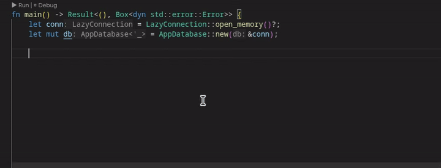

# LazySql
- LazySql is a sqlite library for rust
- Has compile time guarantees
- Ergonomic
- Fast. Automatically caches and reuses preparred statements for you
- However, it follows an opinionated API design
## Quick Start

```rust
use lazysql::{LazyConnection, lazy_sql};

#[lazy_sql]
struct AppDatabase {
    // all create tables must be at the top before read/write logic in order to get compile time cheks

    // dont have to import sql! macro. lazy_sql brings along with it
    init: sql!("
        CREATE TABLE IF NOT EXISTS users (
            id INTEGER PRIMARY KEY NOT NULL,
            username TEXT NOT NULL,
            is_active INTEGER NOT NULL CHECK (is_active IN (0, 1)) -- the library infers this as bool. more info below
        )
    "),

    // postgres `::` type casting is supported. Alternatively u can use CAST AS syntax
    add_user: sql!("INSERT INTO users (id, username, is_active) VALUES (?::real, ?, ?)"),

    get_active_users: sql!("SELECT id::real, username, is_active as active FROM users WHERE is_active = ?"),
}

fn main() -> Result<(), Box<dyn std::error::Error>> {
    let conn = LazyConnection::open_memory()?;

    // The 'new' constructor is generated automatically
    let mut db = AppDatabase::new(&conn);

    // You can now call the methods and it will run the sql commands
    db.init()?;

    // Types are enforced by Rust
    // Respects type inference. i64 -> f64 for id (first argument)
    db.add_user(0.0, "Alice", true)?;
    db.add_user(1.0, "Bob", false)?;

    // active_users is an iterator
    let active_users = db.get_active_users(true)?;

    for user in active_users {
        // u can access the fields specifically if you want
        // Respects Aliases (is_active -> active)
        let user = user?;
        println!("{} {}, {}", user.active, user.username, user.id); // note user.id is float as we type casted it in the sql stmt
    }

    Ok(())
}
```
has some nice QOL features like hover over to see sql code and good ide support



---
- The type inference system and compile time check also works well for `joins`, `ctes`, `window function`, `datetime functions` `recursive ctes`, `RETURNING` and more complex scenarios.

- Since SQLite defaults to nullable columns, the type inference system defaults to Option<T>. To use concrete types (e.g., String instead of Option<String>), explicitly add NOT NULL to your table definitions


- It is strongly recommended to use [STRICT tables](https://sqlite.org/stricttables.html) for better compile time guarantees. Recommended to use [WITHOUT ROWID](https://www.sqlite.org/withoutrowid.html).

- There will be rare scenarios when a type is impossible to infer. `LazySql` will tell you specifically which binding parameter or expression cannot be inferred and will suggest using type casting via PostgreSQL's `::` operator or standard SQL's `CAST AS`. Note that you can't type cast as `boolean` for now.

    For instance,

    
    

## Configuration Methods

`lazysql` supports 3 ways to define your schema, depending on your workflow.

### 1. Inline Schema (Standalone)

As seen in the Quick Start. Define tables inside the struct.

```rust
#[lazy_sql]
struct App { ... }
```

### 2. SQL File

Point to a `.sql` file. The compile time checks will be done against this sql file (ensure that there is `CREATE TABLE`). `lazysql` watches this file; if you edit it, rust recompiles automatically to ensure type safety.

```rust
#[lazy_sql("schema.sql")]
// you dont have to create tables. Any read/write sql queries gets compile time guarantees.
struct App { ... }
```

### 3. Live Database

Point to an existing `.db` binary file. `lazysql` inspects the live metadata to validate your queries.

```rust
#[lazy_sql("production_snapshot.db")]
struct App { ... }
```

Note: for method 2 and 3, you can techinically CREATE TABLE as well but to ensure that they are taken into considreration for compile time check, add them at the top of your struct

## Features & Usage

the `lazy_sql!` macro brings along `sql!` and `sql_runtime!` macro. so there is no need to import them. and they can only be used within structs defined with `lazy_sql!`

### The `sql!` Macro

Always prefer to use this. It automatically:

1.  **Infers Inputs:** Maps `?` to Rust types (`i64`, `f64`, `String`, `bool`).
2.  **Generates Outputs:** For `SELECT` queries, creates a struct named after the field

### The `sql_runtime!` Macro

Use this only when u need the sql to to be runned at runtime. And there are some additional things to take note of when using this macro

#### 1. `SELECT`

You can map a query result to any struct by deriving `SqlMapping`.

`SqlMapping` maps columns by **index**, not by name. The order of fields in your struct **must** match the order of columns in your `SELECT` statement exactly.

```rust
use lazysql::{SqlMapping, LazyConnection, lazy_sql};

#[derive(Debug, SqlMapping)]
struct UserStats {
    total: i64,      // Maps to column index 0
    status: String,  // Maps to column index 1
}

#[lazy_sql]
struct Analytics {
    get_stats: sql_runtime!(
        UserStats, // pass i the struct so u can access the fields later
        "SELECT count(*) as total, status
         FROM users
         WHERE id > ? AND login_count >= ?
         GROUP BY status",
        i64, // Maps to 1st '?'
        i64  // Maps to 2nd '?'
    )
}

fn foo{
    let conn = LazyConnection::open_memory()?;
    let mut db = Analytics::new(&conn);

    let foo = db.get_stats(100, 5)?;
    for i in foo{
        // i.total and i.status is accessible
    }
}
```

#### 2. No Return Type

For `INSERT`, `UPDATE`, or `DELETE` statements

```rust
#[lazy_sql]
struct Logger {
    log: sql_runtime!("INSERT INTO logs (msg, level) VALUES (?, ?)", String, i64)
}
// can continue to use it normally.
```

### Other features

1. supports postgres `::` type casting syntax. Note for now bool aint spported TODO

   ```rust
   sql!("SELECT price::text FROM items")

   // Compiles to:
   // "SELECT CAST(price AS TEXT) FROM items"
   ```

2. iterators has 2 additional methods. `all()` and `first()`

   - `all()` collects the iterator into a vector. Just a lightweight wrapper around .collect() to prevent adding type hints (Vec<\_>) in code

   - `first()` Returns the first row if available, or None if the query returned no results.

   e.g.

   ```rust
   let results = db.get_active_users(false)?;
   let first_result = results.first()?.unwrap(); // returns first column from the returned rows
   ```

   and

   ```rust
   let results = db.get_active_users(false)?;
   let collected_results =results.all()?; // returns a vec of owned  results from the returned rows
   ```

### Type Mapping

| SQLite Context | Rust Type         | Notes                                                                                                                                                                                                                                        |
| :------------- | :---------------- | :------------------------------------------------------------------------------------------------------------------------------------------------------------------------------------------------------------------------------------------- |
| `TEXT`         | `String` / `&str` |                                                                                                                                                                                                                                              |
| `INTEGER`      | `i64`             |                                                                                                                                                                                                                                              |
| `REAL`         | `f64`             | Includes `FLOAT`, `DOUBLE`                                                                                                                                                                                                                   |
| `BOOLEAN`      | `bool`            | Requires `CHECK (col IN (0,1))` or `Check (col = 0 OR col = 1)`. You could techinically use `BOOL` or `BOOLEAN` as the data type when creating table (due to sqlite felxible type nature) and it would work as well. But this is discouraged |
| Nullable       | `Option<T>`       | When a column or expr has a possibility of returning `NULL`, this will be returned. its recommended to use `NOT NULL` when creating tables so that ergonoimic wise you dont have always use Some(T) when adding parameters                   |


## Notes

### Strict INSERT Validation

- Although standard SQL allows inserting any number of columns to a table, lazysql checks INSERT statements at compile time. If you omit any column (except for `AUTOINCREMENT` and `DEFAULT`) code will fail to compile. This means you must either specify all columns explicitly, or use implicit insertion for all columns. This is done to prevent certain runtime errors such as `NOT NULL constraint failed` and more.


### False positive during compile time checks
- I tried my best to support as many sql and sqlite-specific queries as possible. In the extremely rare case of a false positive (valid SQL syntax **fails** or type inference **incorrectly fails**), you can fall back to the `sql_runtime!` macro. Would appreciate it if u could open an issue as well.

### Cannot type cast as Boolean
- This is a limitation of sqlite since it doesn't natively have `boolean` type. I may find some workaround in the future but its not guaranteed. For now if you want to type cast as bool, u have to type cast it as an `integer` and add either 1 (`TRUE`) or 0 (`False`)

## TODOS
1. [upsert](https://www.cockroachlabs.com/blog/sql-upsert/)
2. transactions
3. check_constarint field in SELECT is ignored for now. maybe in future will make use of this field
4. cant cast as bool
